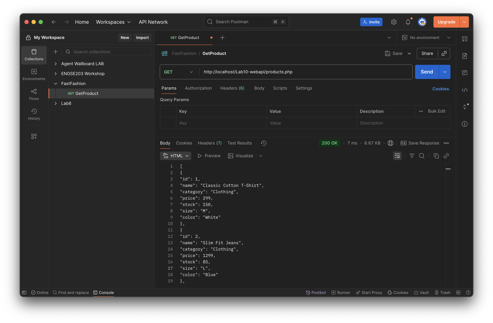
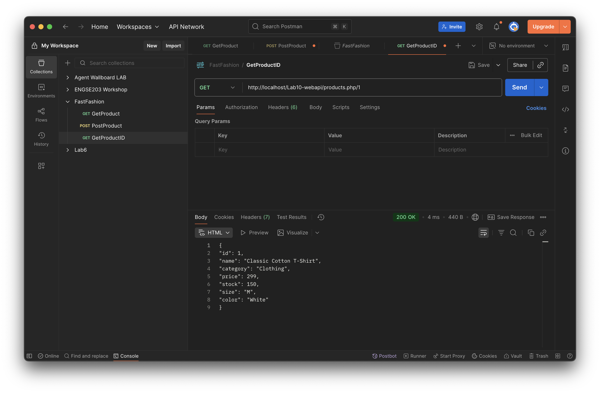
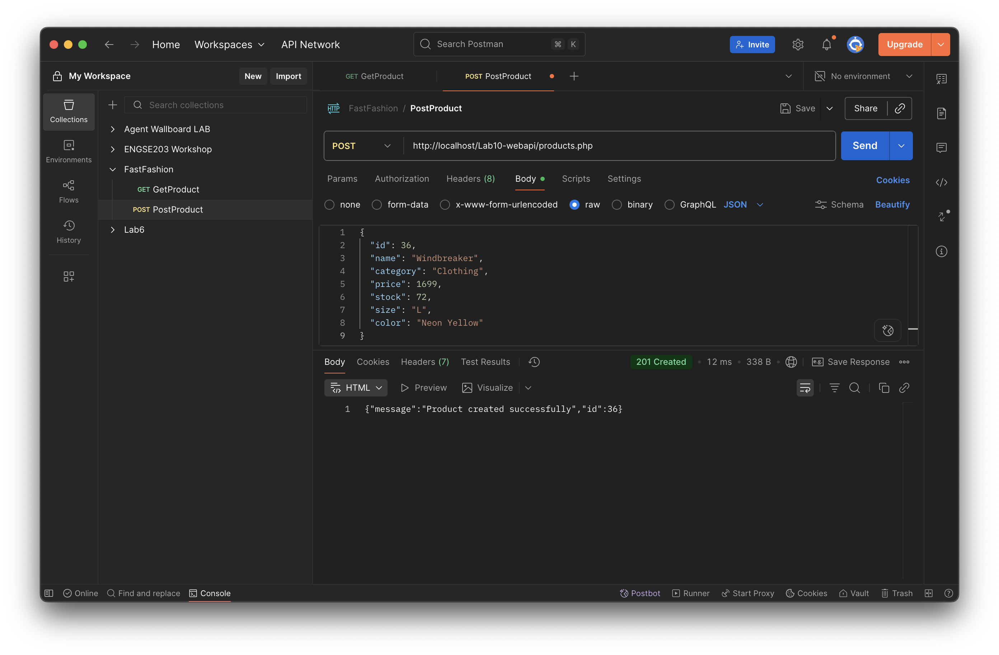
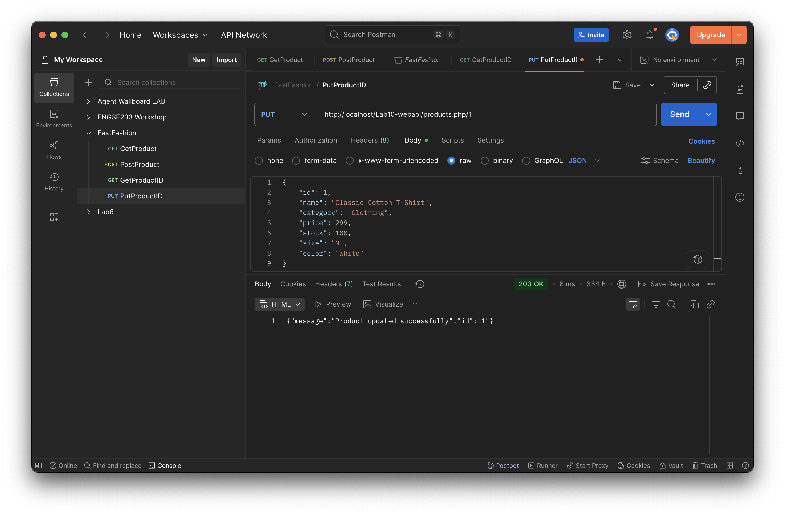
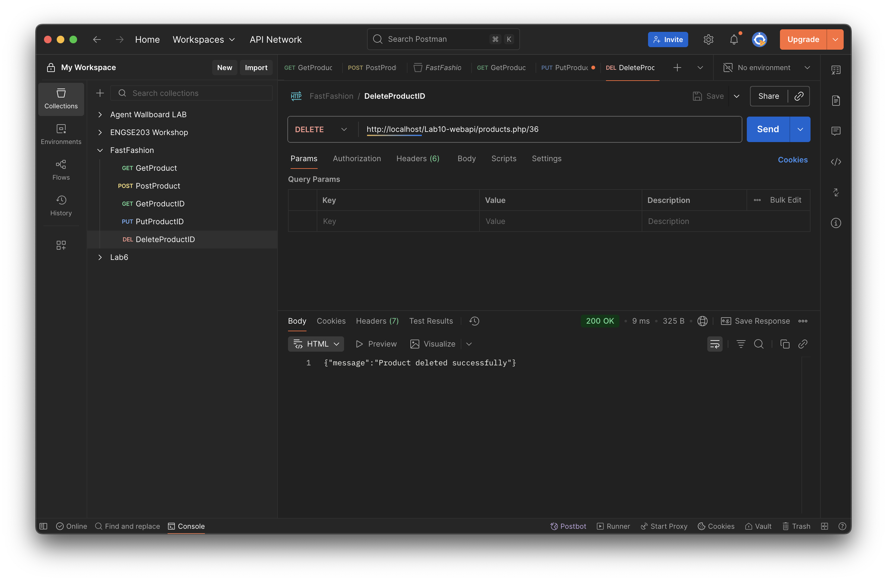

# 🛍️ FastFashion Web API

> RESTful API สำหรับจัดการระบบสินค้าแฟชั่น ด้วย PHP และ MySQL

[](https://www.php.net/)
[](https://www.mysql.com/)
[](https://www.apachefriends.org/)

---

## 📋 สารบัญ

- [ภาพรวม](#-ภาพรวม)
- [การติดตั้ง](#-การติดตั้ง)
- [API Endpoints](#-api-endpoints)
- [ตัวอย่างการใช้งาน](#-ตัวอย่างการใช้งาน)

---

## 🎯 ภาพรวม

FastFashion Web API เป็น RESTful API ที่พัฒนาด้วย PHP สำหรับจัดการข้อมูลสินค้าแฟชั่น รองรับการดำเนินการ CRUD (Create, Read, Update, Delete) แบบเต็มรูปแบบ

### ✨ ฟีเจอร์หลัก

- 📦 จัดการสินค้าทั้งหมด (ดู/เพิ่ม/แก้ไข/ลบ)
- 🔍 ค้นหาสินค้าตาม ID
- 📊 รองรับข้อมูล JSON
- 🚀 RESTful API มาตรฐาน
- 💾 เชื่อมต่อ MySQL Database

---

## 🗄️ โครงสร้างฐานข้อมูล

**ชื่อฐานข้อมูล:** `fastfashion`  
**ชื่อตาราง:** `Product`

### 📊 โครงสร้างตาราง

| คอลัมน์       | ชนิดข้อมูล     | Null | Default | คำอธิบาย                      |
|--------------|---------------|------|---------|------------------------------|
| `ProductID`  | `INT(11)`     | ❌   | -       | 🔑 Primary Key (Auto Increment) |
| `ProductName`| `VARCHAR(100)`| ❌   | -       | ชื่อสินค้า                    |
| `CategoryName`| `VARCHAR(50)`| ❌   | -       | หมวดหมู่สินค้า                |
| `Size`       | `VARCHAR(10)` | ✅   | `NULL`  | ขนาด (S, M, L, XL)            |
| `Color`      | `VARCHAR(30)` | ✅   | `NULL`  | สีของสินค้า                   |
| `Price`      | `DECIMAL(10,2)`| ❌  | -       | ราคา (บาท)                    |
| `Stock`      | `INT(11)`     | ✅   | `0`     | จำนวนในสต็อก                  |

---

## 🚀 การติดตั้ง

### ความต้องการของระบบ

- 🟦 XAMPP (Apache + MySQL)
- 🐘 PHP 7.4 หรือสูงกว่า
- 🗃️ MySQL 5.7 หรือสูงกว่า

### ขั้นตอนการติดตั้ง

1. **ติดตั้งและเปิด XAMPP**
   ```bash
   # เปิดใช้งาน Apache และ MySQL
   ```

2. **สร้างฐานข้อมูล**
   - เปิด phpMyAdmin ที่ `http://localhost/phpmyadmin`
   - Import ไฟล์ `products.sql`

3. **วางไฟล์ API**
   ```bash
   C:/xampp/htdocs/Lab10-WebAPI/
   ```

4. **เข้าถึง API**
   ```
   http://localhost/Lab10-WebAPI/products.php
   ```

---

## 🔌 API Endpoints

### Base URL
```
http://localhost/Lab10-WebAPI/products.php
```

### 📋 สรุป Endpoints

| Method | Endpoint | คำอธิบาย |
|--------|----------|----------|
| `GET` | `/products.php` | ดูสินค้าทั้งหมด |
| `GET` | `/products.php/{id}` | ดูสินค้ารายการเดียว |
| `POST` | `/products.php` | เพิ่มสินค้าใหม่ |
| `PUT` | `/products.php/{id}` | แก้ไขข้อมูลสินค้า |
| `DELETE` | `/products.php/{id}` | ลบสินค้า |

---

## 💡 ตัวอย่างการใช้งาน

### 1. 📖 ดูสินค้าทั้งหมด (GET All Products)

**Request:**
```http
GET http://localhost/Lab10-WebAPI/products.php
```

**Response:**
```json
[
  {
    "id": 1,
    "name": "Classic Cotton T-Shirt",
    "category": "Clothing",
    "price": 299,
    "stock": 150,
    "size": "M",
    "color": "White"
  }
]
```



---

### 2. 🔍 ดูสินค้ารายการเดียว (GET Single Product)

**Request:**
```http
GET http://localhost/Lab10-WebAPI/products.php/1
```

**Response:**
```json
{
  "id": 1,
  "name": "Classic Cotton T-Shirt",
  "category": "Clothing",
  "price": 299,
  "stock": 150,
  "size": "M",
  "color": "White"
}
```



---

### 3. ➕ เพิ่มสินค้าใหม่ (POST Product)

**Request:**
```http
POST http://localhost/Lab10-WebAPI/products.php
Content-Type: application/json
```

**Request Body:**
```json
{
  "id": 36,
  "name": "Windbreaker",
  "category": "Clothing",
  "price": 1699,
  "stock": 72,
  "size": "L",
  "color": "Neon Yellow"
}
```

**Response:**
```json
{
  "message": "Product created successfully",
  "id": 36
}
```



---

### 4. ✏️ แก้ไขสินค้า (PUT Product)

**Request:**
```http
PUT http://localhost/Lab10-WebAPI/products.php/1
Content-Type: application/json
```

**Request Body:**
```json
{
  "id": 1,
  "name": "Classic Cotton T-Shirt",
  "category": "Clothing",
  "price": 299,
  "stock": 100,
  "size": "M",
  "color": "White"
}
```

**Response:**
```json
{
  "message": "Product updated successfully"
}
```



---

### 5. 🗑️ ลบสินค้า (DELETE Product)

**Request:**
```http
DELETE http://localhost/Lab10-WebAPI/products.php/36
```

**Response:**
```json
{
  "message": "Product deleted successfully"
}
```



---
